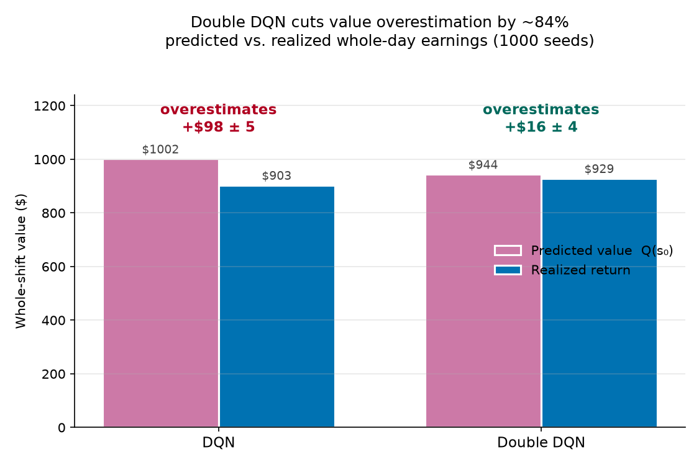
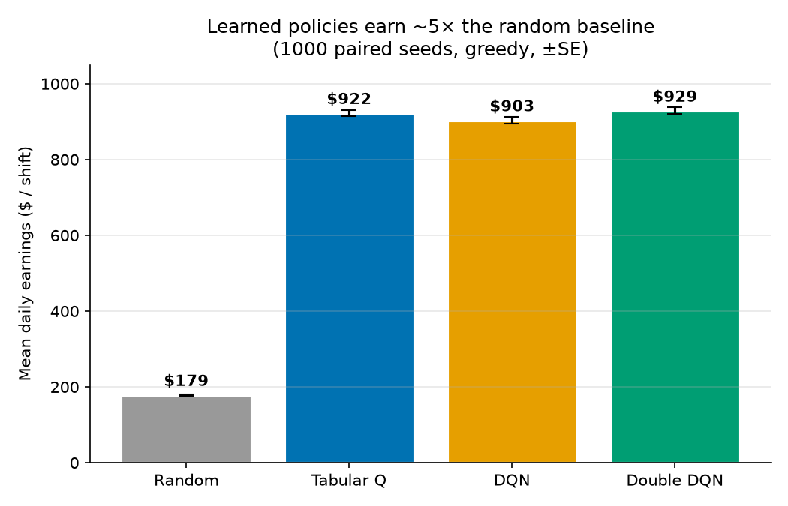
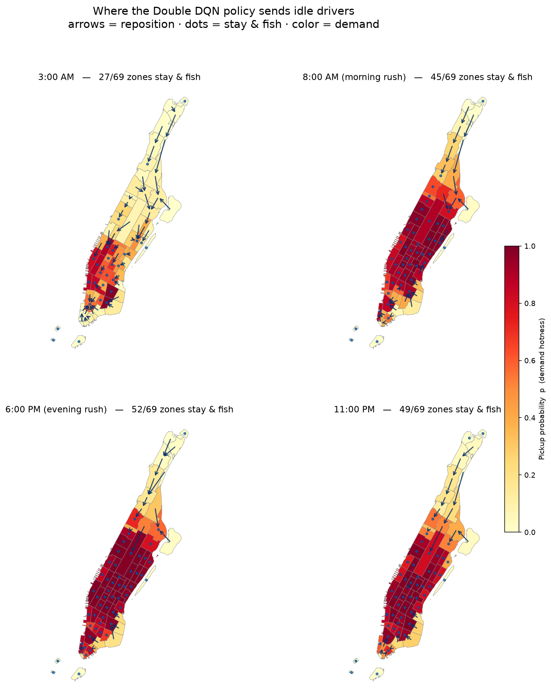

# NYC Taxi Repositioning — Value-Based RL from the ground up

**Where should an idle NYC taxi driver go to catch the next fare?** This project
answers that with **real NYC trip data** and solves it **three ways** —
tabular Q-learning → DQN → Double DQN — each algorithm built from scratch, each
motivated by a concrete limitation of the one before.

The goal isn't a headline win. It's an **honest, end-to-end study** of value-based
RL on a real problem: what each method actually buys you, and where it doesn't.

---

## TL;DR

- A single idle driver repositioning across Manhattan's ~69 taxi zones, driven by
  **6.9M real yellow-cab trips** (NYC TLC, June 2019). Modeled as a finite-horizon
  **Semi-MDP** — a full shift, γ=1, so the return you optimize *is* the day's earnings.
- **All three learned policies earn ~5× a tuned random baseline** (~\$920 vs \$179/day).
- **Tabular Q-learning solves it** (near-optimal on a feasible state space).
- **DQN matches tabular with ~5× fewer episodes** — its win is *sample efficiency*,
  not final performance. An ablation shows the small residual gap is
  function-approximation cost, **not** missing information.
- **Double DQN cuts value overestimation by ~84%** (predicted-vs-realized bias
  \$98 → \$16) — the clean, textbook result of the whole project.



---

## The problem

An idle driver sits in some zone at some time of day and must choose: **fish for a
fare here**, or **reposition to an adjacent zone** hoping for better luck. Fares
carry them somewhere new; the shift is finite; the clock is the scarce resource.

- **State:** `(zone, time-of-day bucket)` — 69 Manhattan zones × 288 five-minute buckets.
- **Actions:** stay-and-fish, or move to an adjacent zone (a 69-way action space where
  "move to your own zone" = stay). Illegal moves are masked from the zone-adjacency graph.
- **Dynamics (event-driven Semi-MDP):** staying is a stochastic pickup whose probability
  scales with historical demand; a fare advances the clock by the trip's real duration and
  drops you at a real, demand-weighted destination. Moving costs travel time. The episode
  ends when the shift clock runs out.
- **Reward:** the fare collected. With **γ=1 and a finite horizon**, the objective is
  simply *total earnings for the shift* — the most interpretable target there is.

Everything — demand, destination distributions, fares, trip durations, zone adjacency —
is estimated from the real trip records and the official taxi-zone shapefile.

---

## Why three algorithms

The project deliberately solves **one** problem with a **progression**, so each step
teaches something the last couldn't:

| Step | Algorithm | Motivation | Result |
|------|-----------|------------|--------|
| **M2** | **Tabular Q-learning** | Feel Bellman/TD directly on a coarse state | Solves it: **\$922** |
| **M3** | **DQN** | Generalize with a neural net instead of a lookup table | Matches tabular (**\$903**), 5× more sample-efficient |
| **M4** | **Double DQN** | Fix DQN's known value **overestimation** | Bias **\$98 → \$16**; return **\$929** |

The honest finding is baked into the arc: on a state space small enough that a table
is **feasible**, the table is the gold standard — so DQN can only *match* it, and the
interesting question becomes *how* (sample efficiency) and *what breaks* (overestimation),
not *whether it wins*.

---

## Results

### Earnings — all learned policies ≈ 5× random

Evaluated on **1000 fixed, paired seeds** (every policy sees the identical set of days),
greedy, ±standard error:



| policy | mean \$/day | vs random | vs tabular |
|---|---|---|---|
| Random (tuned floor) | 178.6 ± 2.3 | — | — |
| Tabular Q | 922.4 ± 8.8 | **+743.8 ± 7.4** (99.9% of days) | — |
| DQN | 903.4 ± 9.2 | +724.8 ± 7.7 | −19.0 ± 4.7 |
| Double DQN | 928.6 ± 9.1 | +749.9 ± 7.8 | +6.2 ± 4.1 |

The three learned methods are **statistically in the same ballpark** — the honest
reading is "they all reach a near-optimal policy," not "one crushes the others."

### DQN's real edge: sample efficiency, and it's not information-limited

DQN reaches ~\$900 in ~**10k episodes**; tabular needed **tens of thousands** to cover
its 120k state-action cells. To test whether DQN's −\$19 vs tabular was a *missing
information* problem, I fed it the exact demand signal as extra features (current +
neighbor pickup probability). **It changed nothing** (\$903.4 → \$903.4) — proving the
residual gap is inherent function-approximation smoothing, not a lack of information.

### Double DQN: overestimation, measured and corrected

The headline. `Q(s₀)` is the network's *forecast of whole-shift earnings*; comparing it
to the *realized* return over 1000 seeds isolates the bias:

- **DQN** predicts \$1002, earns \$903 → **overestimates by \$98 ± 5**.
- **Double DQN** predicts \$944, earns \$929 → **\$16 ± 4**.

Decoupling action *selection* (online net) from *evaluation* (target net) removes ~84%
of the bias — the classic Double DQN result, reproduced from scratch. The better-calibrated
values also nudge the policy from \$903 to \$929.

### What the policy actually learned

Coloring zones by demand and drawing the greedy policy's chosen move per zone across the
day: the "stay & fish" count **tracks demand** (27/69 zones at 3 AM → 52/69 at the 6 PM
peak), and idle drivers are consistently pulled **from cold zones toward the hot core** —
a sensible repositioning instinct that emerged purely from training.



### A day in the life

Watching one driver's full day under the greedy Double DQN policy — zones recolor by
demand as the clock advances, the car's style shows whether it's **searching**,
**repositioning empty**, or **carrying a passenger**, and the side panel tracks cumulative
earnings:


---

## Honest caveats

This is a clean experiment, not a production dispatcher — and knowing the boundary matters:

- **Single-agent, exogenous demand.** One driver doesn't deplete demand or compete with
  other cabs. Real fleets are a multi-agent equilibrium.
- **Fixed competition constant κ.** Pickup probability uses a constant stand-in for driver
  supply (the TLC data has no empty-cab supply signal). Real supply *chases* demand, so the
  true hot-vs-cold gap is smaller than modeled.
- **Absolute dollars are inflated** by the above. **Read the relative deltas**, not the
  \$ levels — the comparisons (learned vs random, tabular vs DQN vs Double DQN) are the
  meaningful, honest results.
- **Demand is a monthly average**, deterministic given `(zone, time)` — which is exactly
  *why* the table is feasible and DQN can't beat it. Genuine day-to-day stochastic demand
  is the natural next step (see below).

---

## Repo structure

```
data/
  yellow_tripdata_2019-06.parquet   # raw NYC TLC trips (not committed if large)
  taxi_zone_lookup.csv, taxi_zones/ # zone lookup + shapefile
  artifacts/                        # built lookups: demand, destinations, fares, adjacency, centroids, id maps
src/
  preprocess.py     # one-time: raw trips + shapefile -> artifacts
  env.py            # TaxiEnv — the Semi-MDP
  qLearning_agent.py, train.py          # M2: tabular Q-learning
  model.py, buffer.py, dqn_agent.py, train_dqn.py   # M3/M4: DQN + Double DQN (double flag)
  eval.py           # paired 1000-seed evaluation + overestimation diagnostic
  figures.py, map_figure.py, graph.py   # static figures
  animate_day.py                        # animated 'day in the life' GIF
result/
  qTable.npy, qnet.pth, qnet_ddqn.pth   # trained models
  plots/                                # figures
```

## How to run

```bash
pip install -r requirements.txt          # numpy, pandas, torch, geopandas, matplotlib, pyarrow
cd src
python preprocess.py                     # build data/artifacts (one-time)
python train.py                          # tabular Q  -> result/qTable.npy
python train_dqn.py                      # DQN / Double DQN (set double=True) -> result/qnet*.pth
python eval.py                           # 1000-seed paired comparison + overestimation
python figures.py && python map_figure.py
```

## What I'd do next

- **Stochastic, observable demand** (real day-to-day variation) — the one change that would
  make the table genuinely infeasible and give DQN a real edge to win.
- **Finer time resolution** (1-min bins) — a state a table can't cover well but a network can.
- **Multi-agent** competition for a faithful fleet model.

---

*Built as a portfolio study of value-based RL fundamentals — Bellman/TD, the tabular
coverage limit, function approximation, and overestimation — on a real-world problem with
real data.*
